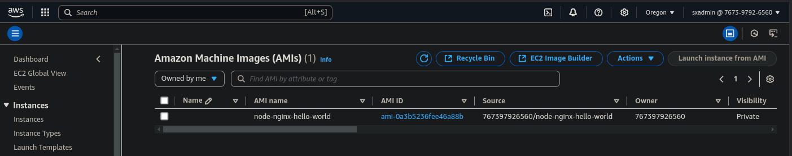

# Despliegue de Nginx y Nodejs con Packer
			madeo05_act1 - Saúl Xicoténcatl López

## Objetivo general
Creación de imágenes reutilizables que puedan ser desplegadas sin intervención humana, es decir, implementaciones basadas en herramientas de infraestructura como código.

## Objetivos específicos
- La creación de plantillas con Packer que soporten aplicaciones de node.js.
- En un entorno configurado con Nginx como servidor web.
- Desplegable en el proveedor de nube pública AWS.
- Que permita la actualización de scripts para migrar funcionalidad en Azure.

## Índice:
- Entorno de trabajo
	* Ambiente local
	* Servicios de nube
	* Requisitos técnicos
- Desarrollo
	* Estructura del proyecto
	* Despliegue
	* Logs
- Conclusiones
- Referencias


## Entorno de trabajo

### Ambiente local
Equipo con sistema operativo con distro de linux Ubuntu/debian Pop!_OS 22.04 LTS de 64 bits, con un nivel de usuario root temporal con el uso del comando *sudo* y la contraseña correspondiente.   


### Servicios de nube
Se requiere una cuenta activa con ambos proveedores de nube, en  particular
- **AWS**:
	* Contratar acceso a EC2 para crear y gestionar instancias.
	* Almacenamiento en S3 si se guardan imágenes.
	* Uso de IAM para roles/permisos.

- **Azure**:
	* Suscripción activa con acceso a Azure Compute para manejar VMs.
	* Almacenamiento en Azure Blob Storage si es necesario guardar discos.
	* Uso de Azure AD para asignar permisos. 

### Requisitos técnicos

**Packer**
De manera local solo se requieren instalar packer como entorno de ejecución, a continuación se muestra el script de referencia del proveedor

``` sh
    wget -O - https://apt.releases.hashicorp.com/gpg | gpg --dearmor -o /usr/share/keyrings/hashicorp-archive-keyring.gpg

    echo "deb [signed-by=/usr/share/keyrings/hashicorp-archive-keyring.gpg] https://apt.releases.hashicorp.com $(lsb_release -cs) main" | sudo tee /etc/apt/sources.list.d/hashicorp.list
    sudo apt update && sudo apt install packer
```

**Az CLI**
``` sh

	sudo apt-get update
	sudo apt-get install apt-transport-https ca-certificates curl gnupg lsb-release

	sudo mkdir -p /etc/apt/keyrings
	curl -sLS https://packages.microsoft.com/keys/microsoft.asc |
	  gpg --dearmor | sudo tee /etc/apt/keyrings/microsoft.gpg > /dev/null
	sudo chmod go+r /etc/apt/keyrings/microsoft.gpg
	Add the Azure CLI software repository:


	AZ_DIST=$(lsb_release -cs)
	echo "Types: deb
	URIs: https://packages.microsoft.com/repos/azure-cli/
	Suites: ${AZ_DIST}
	Components: main
	Architectures: $(dpkg --print-architecture)
	Signed-by: /etc/apt/keyrings/microsoft.gpg" | sudo tee /etc/apt/sources.list.d/azure-cli.sources
	Update repository information and install the azure-cli package:

	sudo apt-get update
	sudo apt-get install azure-cli
``` 
Una vez instalada la sesión, se deberá firmar en la cuenta Azure y generar la credenciales necesaria para sincronizar packer con el grupo de recurso:

``` sh
	az login
	az account list --output table
	az account set --subscription "<SUBSCRIPTION_ID>"
	az ad sp create-for-rbac --name "<SERVICE_PRINCIPAL_NAME>" --role Contributor --scopes /subscriptions/<SUBSCRIPTION_ID>/resourceGroups/<RESOURCE_GROUP_NAME>
``` 


**Variables de entorno**
Con el fin de sincronizar con ambos proveedores de nube, se requerirá cargar los secretos en ambos casos:

- Aws:
``` sh
	export AWS_ACCESS_KEY_ID="<access_id>"
	export AWS_SECRET_ACCESS_KEY="<access_key>"
``` 

- Azure:

``` sh
	export ARM_SUBSCRIPTION_ID="<subscription_id>"
	export ARM_CLIENT_ID="<client_id>"
	export ARM_CLIENT_SECRET="<secret>"
	export ARM_TENANT_ID="<tenant_id>"

``` 
Considere que la vigencia de estas sentencias es temporal mientras no se reinicie la terminal o termine la sesión, donde se cargaron. 


## Desarrollo

### Estructura del proyecto

Tomando en cuenta que requerimiento principal es el uso de node lenguaje, como lenguaje de programación para el desarrollo de la appa, y Nginx como el servidor, se tiene la siguiente estructura del proyecto:

	packer-project/
	├── app.js               
	├── nginx_config         
	│   └── app.conf
	├── scripts/            # Scripts de instalación de dependencias
	│   ├── install_node.sh
	│   ├── install_nginx.sh
	│   └── configure_app.sh
	├── template.pkr.hcl    # Plantilla Packer 


Dónde app.js se trata de una función dummy tipo 'hola mundo' para validar que el aprovisionamiento y dependencias son cargadas exitosamente.

``` js
	const http = require('http');

	const hostname = '127.0.0.1';
	const port = 3000;

	const server = http.createServer((req, res) => {
		res.statusCode = 200;
		res.setHeader('Content-Type', 'text/plain');
		res.end('Hello, World!\n');
	});

	server.listen(port, hostname, () => {
		console.log(`Server running at http://${hostname}:${port}/`);
	});

```

Mientras que scripts es donde se tiene los script de shell para cargar las dependencias en la imagen, por ejemplo, *install_node.sh* tiene la siguiente estructura.

``` Sh 
	#!/bin/bash
	# Liberar bloqueos de yum
	sudo rm -f /var/run/yum.pid
	sudo yum clean all

	# Actualizar sistema
	sudo yum update -y
	sleep 30

	# Habilitar Node.js
	sudo amazon-linux-extras enable nodejs
	sudo yum install -y nodejs
	sleep 30
```

Por último, la plantilla de packer como orquestador, construirá la imagen basándose en este tipo de estructura

``` sh
	packer {
		# ¿Qué proveedor de nube se usará?
	}
	source {
		# ¿Cual es la imagen base a usar?
		# ¿Qué nombre tendrá la nueva imagen?
		# ¿En qué lugar se almacenará la imagen resultante?
	}
	build {
		# ¿Qué se va instalar?
		# ¿Cómo se va a configurar?
		# ¿Qué archivos se van a copiar?
	}
```
El detalle se puede ver directamente en el archivo *template.pkr.hcl*.


### Despliegue
En la raiz del proyecto se procederá con la validación y ejecución de la plantilla a través de 
``` sh
	packer init template
	packer fmt template.pkr.hcl
	packer validate template.pkr.hcl 
	packer build template.pkr.hcl 
```

### Logs 
A manera de evidencia, en la terminal se mostrarán una cantidad significativa de logs donde se muestre la ejecución de cada uno de los pasos de aprovisionamiento, por ejemplo:

	[...]
	==> amazon-ebs.amazon-linux: Creating AMI node-nginx-hello-world from instance i-0185861ea521e91ec
		amazon-ebs.amazon-linux: AMI: ami-0a3b5236fee46a88b
	==> amazon-ebs.amazon-linux: Waiting for AMI to become ready...
	==> amazon-ebs.amazon-linux: Skipping Enable AMI deprecation...
	==> amazon-ebs.amazon-linux: Terminating the source AWS instance...
	==> amazon-ebs.amazon-linux: Cleaning up any extra volumes...
	==> amazon-ebs.amazon-linux: No volumes to clean up, skipping
	==> amazon-ebs.amazon-linux: Deleting temporary security group...
	==> amazon-ebs.amazon-linux: Deleting temporary keypair...
	Build 'amazon-ebs.amazon-linux' finished after 5 minutes 59 seconds.

	==> Wait completed after 5 minutes 59 seconds

	==> Builds finished. The artifacts of successful builds are:
	--> amazon-ebs.amazon-linux: AMIs were created:
	us-west-2: ami-0a3b5236fee46a88b


Y en la región correspondiente, en el portal, es posible validar en el inventario de imágenes se encuentra la nueva imágen:



## Conclusiones

- El **uso de módulos** hace que la plantilla sea más legible y más fácil de darle mantenimiento, por ejemplo, intercambiar gestor de paquetes linux **apt** en lugar yum, o usar servidor tipo **Apache** en lugar de Nginx. 

- Es posible crear un módulo especial para la **gestión de parámetros**, incluso, la lectura de las credenciales desde un **baúl de secretos**, haría la plantilla más segura y portable.
		
- Desplegar en un entorno de AWS tiene una **menor complejidad** en cuanto a preparativos que Azure, en este caso, solo requirió del rol y los Access Keys. 

- Por otra parte, Azure requiere el registro de una aplicación, cuya identidad tenga el privilegio de contributor. Dicho **service principal**, requerirá privilegios de administrador para su ejecución.

- Téngase en cuenta que el portal de **EC2 tiene un inventario de AMIS para cada región**, por lo tanto, configure los parámetros de despliegue en congruencia.

- Se recomienda el **uso de Terraform** para la construcción de máquinas virtuales empleando las imágenes generadas con Packer, ya que a diferencia de Biceps o Cloudformation, se puede considerar una herramienta multi nube.

- El uso de PM2 como gestor de aplicaciones node.js es una buena alternativa, para **ejecuciones en segundo plano** con alta disponibilidad.

## Referencias

### De proveedores
* Plantilla de packer para Aws: https://developer.hashicorp.com/packer/tutorials/aws-get-started/aws-get-started-build-image
* Catálogo de regiones para EC2: https://cloud-images.ubuntu.com/locator/ec2/
* Instalar Az CLI: https://learn.microsoft.com/en-us/cli/azure/install-azure-cli-linux?pivots=apt
* Pase a producción de una App en Node.js en Ub 20.04: https://www.digitalocean.com/community/tutorials/how-to-set-up-a-node-js-application-for-production-on-ubuntu-20-04

## Complementarios
* Uso de packer con Aws: https://www.youtube.com/watch?v=dde-bWUeRMo
* Credenciales serverless en Aws Portal: https://www.youtube.com/watch?v=lhPtbUC-f94
* Uso de packer con Azure:https://www.youtube.com/watch?v=v1VjhwQ4KCQ
* Gegistro apps en Azure Portal: https://www.youtube.com/watch?v=PkLrKDW9gY8
* Credenciales serverless en Az CLI: https://www.youtube.com/watch?v=ONX9qvRa1M4


